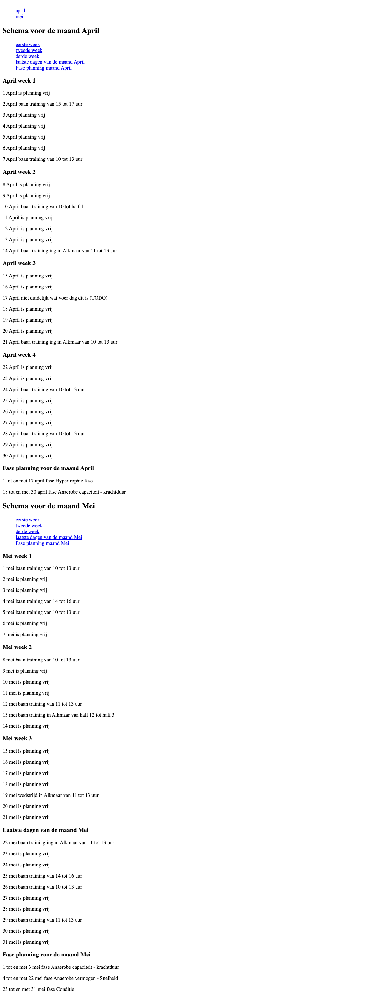
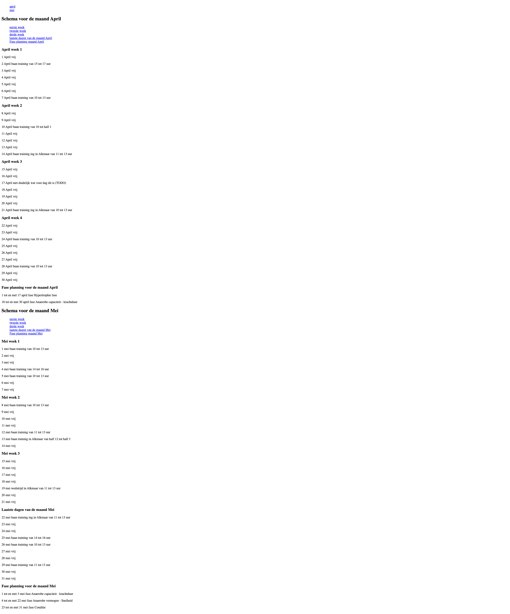

# Web Design @cmda-minor-web 1920
Repository for web design course.
[DEMO](https://mysterious-earth-90737.herokuapp.com/)

## Table of contents
* [Description](#description)
* [Week 1](#week-1)
* [Week 2](#week-2)

## Description
For this project i designed a solution for Larissa Klaassen.
Larissa Klaassen has limited eye sight and cannot see much, to read websites she uses a screenreader to consume the content.
Larissa is a professional athlete and for her training she gets a roster from her coach, this roster is made in excel and this is unreadable for Larissa.

### Case
Understanding a professional athlete's roster.

**Description**
For this project we need to design a solution for Larissa so she can consume the most important information that she needs on a day to day basis, and
if she has anything to do during the coming weekend and the days following.

## Week 1
During the first week we had a meeting with Larissa and we asked her some questions to get to know her better. Larissa rides the tandem
because of her limited eye sight she rides on the back seat. She also is a student in the computer science field.

In order to understand her roster she gets from her coach she sits down with a colleague professional athlete and go through the roster. She does this
every time she gets a new roster. After sitting down with her colleague she knows most of the things that are listed on the roster but not everything.
After going through the roster with her colleague and taking notes on it she never opens the excel sheet again because this is not readable for her and her screenreader.

After this introduction we asked her what she finds the most important information, she said:
* In which phase she is in (e.g. Hypertrophy)
* Important matches
* Training camps
* Training schedule and which location

We also asked her what websites she uses that are great to go through with her screenreader, she said that she realy likes the way the NS (dutch railway company)
structures their information. They do this by bundling the information in small blocks and not hiding information in long sentences, this way she gets the information
she wants very quickly and does not have to search for it.

### Hobby's
We also asked Larissa some personal questions, she told us that she really likes to read books using her braille reader. She also is into riding horses.

## Week 2
For the second week we made a testable prototype to see if Larissa could navigate through the information. When making my prototype i continuously tested the way of navigating
i started structuring the information by month and making sub category's for the weeks. This way she could navigate through the headings to jump per month and switch
to her arrow keys to get into the navigation of that month.

I first structured the weeks of a month by the number of the week (e.g. week 20) but i came to the conclusion that
structuring the weeks like that wasn't clear. If you told me we are in week 20 of year 2020 i would not know in which month that would be and what week of that month it is.
So i started structuring it by saying week 1 of march -> week 2 of march -> week 3 of march -> last week of march.

### Exclusive design principles
While building the prototype i had to keep the 4 exclusive design principles in mind.
These 4 principles are.

* Study situation
* Ignore conventions
* Prioritise identity
* Add nonsense

#### Study situation
It is important to know in what situation your product will be used, we did this during the first week where we got to meet with Larissa and asked her questions about the way she
navigates the web. Things we got to know about studying the situation is that she uses Jaws to read information to her when she uses her computer, she also told us that she does not
like to speak to her machine in order to get information (e.g. Command: What do i have to do this weekend), this is because she also uses her mobile phone and speech would not work
when traveling by public transport and she would feel uncomfortable doing that.

#### Ignore conventions
Websites are mostly build using patterns people are already used to (e.g. hamburger menu for mobile navigation) but this does not work for everyone. In order to know what works
and what does not work we will have to test our solution with Larissa.

#### Prioritise identity
It is important to design a custom solution and cater to the personality of the person that will use your product, this will make using your product much more enjoyable.

#### Add nonsense
It is also important to add some "fun" into your product, try to make your user laugh by adding a funny joke. But don't over do it because your product still has to be useful.

### Prototype 1

Prototype 1 v1

For this first prototype i chose to write in whole sentences, you can see this when there is nothing to do for a day (e.g. 23 Mei is planning vrij).
When testing this solution i came to the conclusion that this took to long to read and it is not useful so i fixed that in prototype 1 v2.

Prototype 1 v2

Here you can see i kept it way shorter and this made it way more easy to navigate through.

### Testing with Larissa
For the first test i asked Larissa to see if she could find her way through the website and if the structure of the information was clear.
She said that she liked that i placed the navigation directly at the top of the page for the month's, that made it possible for her to navigate to the month she wanted
information about very quickly. She also said that the sub navigation inside the month was very useful because she could jump to the week she wanted information about.

She also liked that i placed the phases for the month at the bottom of the month section because she does not have to go through this every time she uses the roster.

#### Points of improvement
During the testing she told me that there are a lot of days where there is nothing on the schedule and that she would like have a concise sentence maybe at the beginning of
a week section that tells her which days there is nothing on the schedule, this is because during the testing she had to wait for each day to hear if there was something on
the schedule and you don't want to have to wait just to hear there is nothing to do for that day.

She also would like if there was a way to jump directly to the planning for the current day so she would not have to navigate through the whole site to get to the information
she needs about the current day.

#### What i noticed
I noticed that Larissa navigates really fast by tabbing through headings and by using contrl l to navigate through list items. She did not wait for the whole sentence to be
read to her when she was going through the information.
